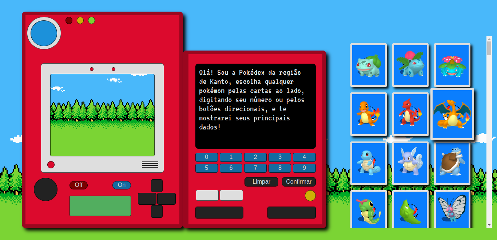
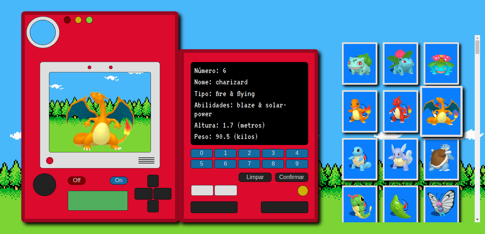
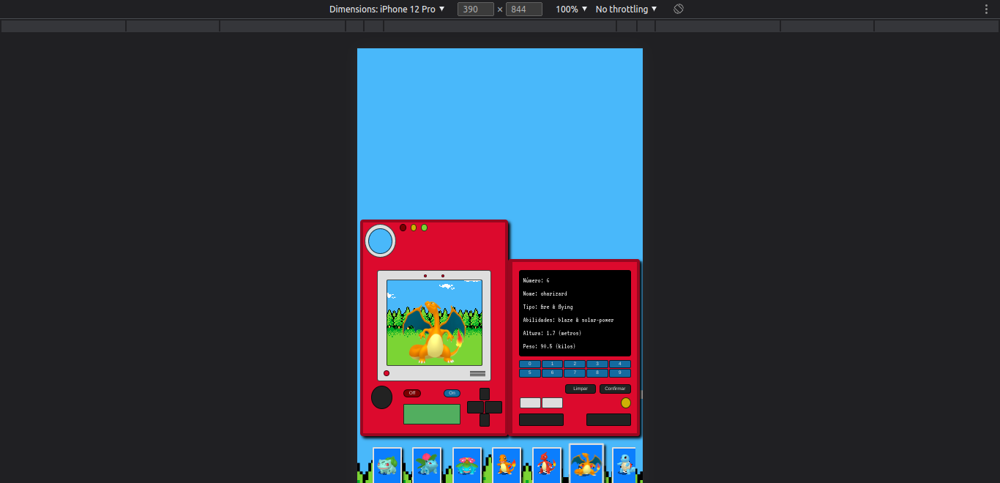

### Pokedex

A Pokemon inspired project that mades available through an API PokeAPI (https://pokeapi.co/docs/v2) a pokedex with several pokemons.

The pokedex was made with HTML, CSS/SASS and JavaScript and use concepts as flexbox and grid layout in the CSS and async/await and REST API in JavaScript.

#### Below it's some images:

#### Pokedex in computer

#### Pokedex in mobile

Download this repository and open file index.html in your browser from your preference for to see the project.

[Click here to see the pokedex](https://mateusesm.github.io/pokedex/)
